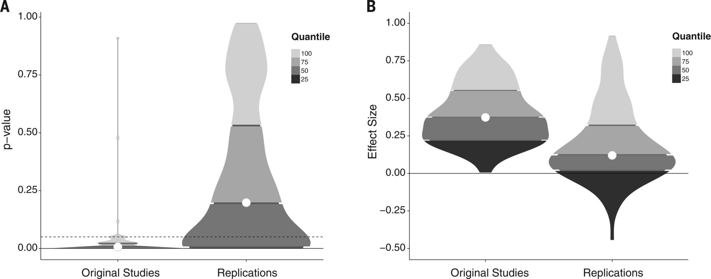
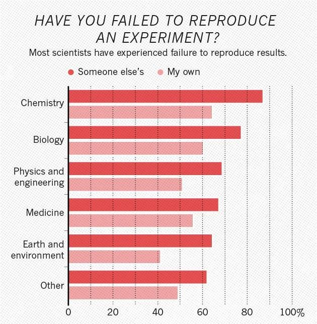
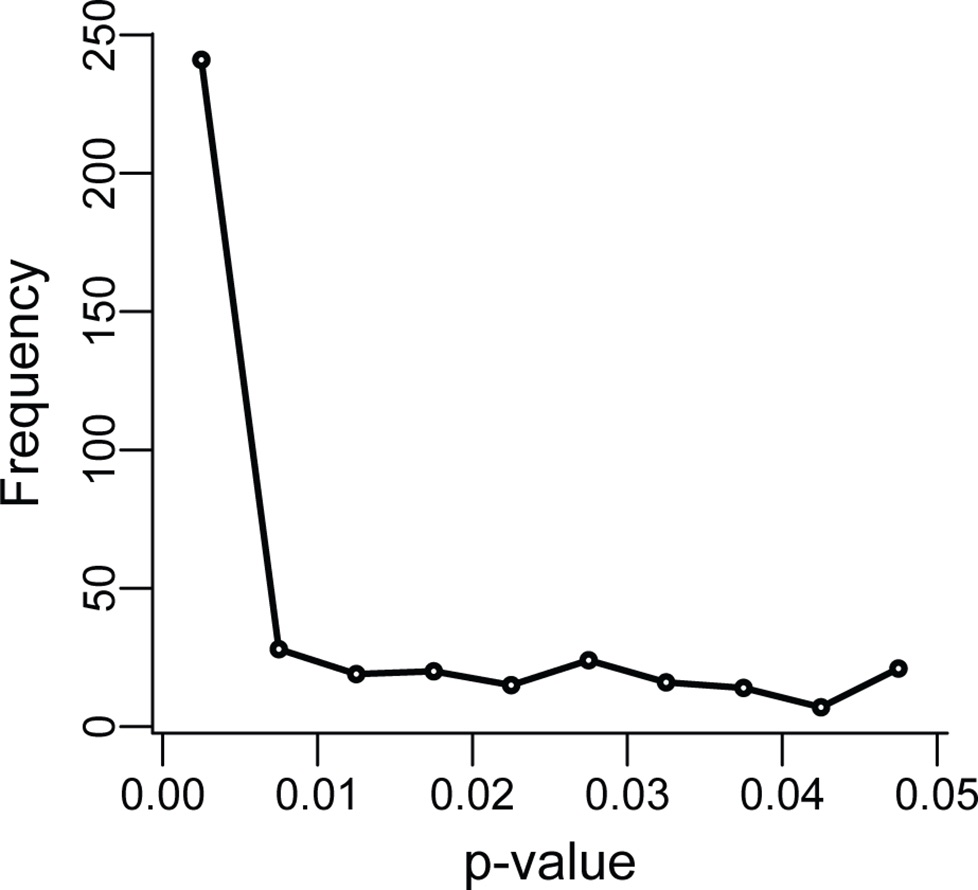

## The reproducibility crisis

__Less than 40%__ of replications of well-known Psychology studies had significant results:

<div class="rimage center"></div>

A similar study found that only __11%__ of replications of well-known cancer biology studies had significant results. 

--- &twocol

## Most researchers think there is a problem with reproducibility

*** =left
<div class="rimage center"></div>

*** =right
Baker, Monya. "1,500 scientists lift the lid on reproducibility." Nature News 533.7604 (2016): 452


--- &twocol

## Most researchers have failed to reproduce a result

*** =left
<div class="rimage center"></div>

*** =right

Of the 1576 scientists surveyed, __over 70% of scientists surveyed have experienced failure to reproduce other's results__ and __over 50% have failed to reproduce their own results__.

---

## Why did it take us so long to notice?
### Un"FAIR" data and analyses
It used to be harder to share and access data and analyses. FAIR principles describe how data/analyses need to be stored in order for them to be used by others:

* __F__indable: People need to know the data exists (e.g. link to in your paper)
* __A__ccessible: Data needs to be available in a format that humans and computers can understand (e.g. downloadable on the internet)
* __I__nteroperable: The data needs to be in a format that people usually use.
* __R__eusable: Data must be clearly licensed so people know if they're allowed to reuse them.

If data is messy, unlabelled, or doesn't exist no one can check if the result is correct. 

---&twocol

## Why is it happening?
### Data storage mistakes
* High-profile studies have been shown to be wrong because of problems like accidentally deleting columns of excel files, or rewriting important values.

### Data analysis mistakes
* When data analysis is carried out by clicking on buttons in a certain order (using a Graphical User Interface or GUI), they can accidentally be clicked in the wrong order and give incorrect results. 
* People's code doesn't always do what they think it does.

---&twocol
## Why is it happening?
*** =left
### P-hacking
P-hacking is a catch-all term for making p-values appear smaller than they are. 

__Examples of p-hacking:__
- Collecting samples until your sample size gives you p < 0.05
- Choosing different statistical tests until you get p < 0.05
- Running lots of statistical tests and not correcting for mulitple hypotheses

*** =right

<div class="rimage center"></div>

<div class="rimage center"></div>

--- &twocol

### HARKing = Hypothesising After Results are Known

*** =left

Instead of trying the same hypothesis with 20 different methodologies, you can get the same effect (finding erroneous "significant" results) by testing 20 different hypotheses and decide what you hypothesised afterwards.

*** =right

<div class="rimage center"></div>

---
## What are the chances?

Time for a simulation in R. 

Please open Rstudio!
<!--

```r
n_reps = 100000
n_tests = 5
significance_cutoff = 0.05

total_wins = 0
for(i in 1:n_reps){
if( sum(runif(n_tests,0,1) < significance_cutoff) ){
  total_wins = total_wins + 1
}
}
print(total_wins/n_reps)
```

```
[1] 0.22703
```
-->

--- &twocol
## Publication Bias
*** =left
There is bias in what is published. We're more interested in positive results.
Publication bias rewards researchers for p-hacking, and also wastes time since researchers will repeat experiments with negative results.

*** =right
It's not always intuitive how damaging extra tests can be. Researchers may think they've triedless models than they think, and we just really want to find out "the truth", so it's easy to say "just one more". 
* Be careful of doing too many statistical tests (it's easy to accidentally p-hack)
* If you're ever unsure about if what you're doing is right, consult a statistician.
* If you need convincing, simulations are very convincing.

---

## Discussion! 

We've mentioned some barriers to reproducibility. 
<!--* P-hacking
* HARKing
* Un"FAIR"ness. 
* Data storage/analysis mistakes
* Publication Bias -->

In small groups (around 5 people), first write down the issues you remember on the paper in front of you in one colour.
__(3 minutes)__

Then discuss how you think these reproducibility problems mentioned might affect your fields. 
__(5 minutes)__

--- &twocol

## Tools and practices to aid us in research
*** =left
### Make data available
- Either share your original data freely
- Even sensitive data (using secure storage [data.bris](https://data.bris.ac.uk/data/) and a data access committee)
- Make anonymised data available.
- Make synthesised data available.
- Whatever you make available, make sure that it is labelled and described.

*** =right
<div class="rimage center"></div>


<div class="rimage center"></div>

--- &twocol

## Make analysis available
*** =left
__Scripts__ make analysis available by writing scripts, they:
- Describe exactly what your analysis is and can be shared with others
- Can be written in any programming language (e.g R, Python)
- Always perform in the same order and get the same result
- Those written in non-proprietry software (e.g. R and python, rather than SPSS/Stata) are more accessible.

*** =right
__Literate programming__ = scripts + describing what's happening

Ways to do it:
- Comments
- Documentation and README files (e.g. on GitHub)
- Notebooks (e.g. RMarkdown, Jupyter)

--- &twocol

## Version Control

*** =left

* You will want different versions of your scripts/notebooks.
* Nothing is worse than knowing your program worked earlier.
* Having files named `analysis_ver32_final_actually_final.R` is not fun and it's easy to make mistakes.
* When you come back to your work later, you won't be able to remember which is the `for_realsies_final_file.txt`

Version control is a system for avoiding these problems.

*** =right
<div class="rimage center"></div>

--- &twocol

## Pre-registration
*** =left
*The first principle is you must not fool yourself — and you are the easiest person to fool* - Richard Feynman

<div class="rimage center"></div>
*** =right

Pre-registering your analyis is saying what analysis you are going to do in advance, including:
* which variables you are going to look at
* what sample size you will aim for
* what you will exclude from your sample
* what variables you are going to correct for

__Pre-registration is only for analyses where you are seeking to confirm a hypothesis__


--- &twocol
## [Registered reports](https://cos.io/rr/)

Registered reports are a new model for publishing papers. Instead of applying to journals once you have your results, you apply while after you have made plans for research and analysis, but before you have collected your data.

Extra great for research(ers) because:
* You can publish non-significant results 
* We will all be able to benefit from knowing what __doesn't__ work.

<div class="rimage center"></div>

--- &twocol

## Draw a "concept map" about reproducibility

*** =left
__Task:__

1. Create concept maps in small groups (__10 mins__)
2. Feed back to the group 

*** =right
__How-to:__

We already have some of the barriers to reproducibility written down (e.g. publication bias, p-hacking), so add to this by writing some of the solutions to the reproducibility crisis to your paper e.g.: pre-registration. If you'd like to you can add more specific things that you have heard of (e.g. the Open Science Framework).

Then draw relationships between them, for example:
* publication bias --rewards--> p-hacking
* pre-registration --prevents--> p-hacking
* OSF --tool used for--> pre-registration
